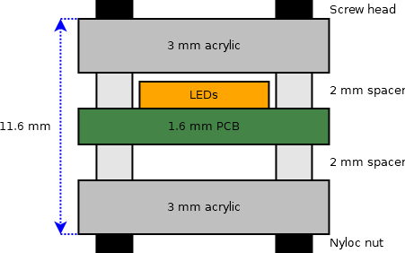
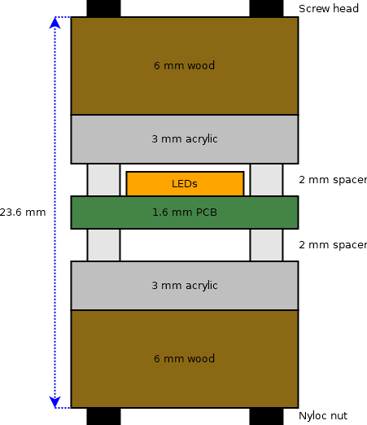

Mechanical design for LED Hourglass
===================================

<table cellspacing="0" cellpadding="0" border="1">
  <colgroup>
    <col span="1" style="width: 40%;">
    <col span="1" style="width: 30%;">
    <col span="1" style="width: 20%;">
  </colgroup>
  <tr>
    <th>Stackup (side view)</th>
    <th>Description</th>
    <th>Files for laser cutting</th>
  </tr>
  <tr>
    <td></td>
    <td>The <a href="./hourglass-panel.svg">hourglass-panel.svg</a> design is cut out of a piece of acrylic (something like this <a href="https://www.ponoko.com/materials/glass-green-acrylic">glass green acrylic</a>) and placed either side of the PCB with plastic unthreaded stand-offs in between. A screw goes in each corner goes through the acrylic, spacers & the PCB and secure with a nyloc nut to hold he whole thing together.</td>
    <td></td>
  </tr>
  <tr>
    <td></td>
    <td>The <a href="./hourglass-glass.svg">hourglass-glass.svg</a> design is cut out of a piece of acrylic (something like this <a href="https://www.ponoko.com/materials/glass-green-acrylic">glass green acrylic</a>) and the <a href="./hourglass-frame.svg">hourglass-frame.svg</a> design is cut out of some kind of wood (like this <a href="https://www.ponoko.com/materials/macrocarpa-hardwood">macrocarpa hardwood</a>). One piec of each is  placed either side of the PCB with plastic unthreaded stand-offs between the PCB and acrylic. A screw goes in each corner goes through the acrylic, wood, spacers & the PCB and secure with a nyloc nut to hold he whole thing together.</td>
    <td></td>
  </tr>
</table>
